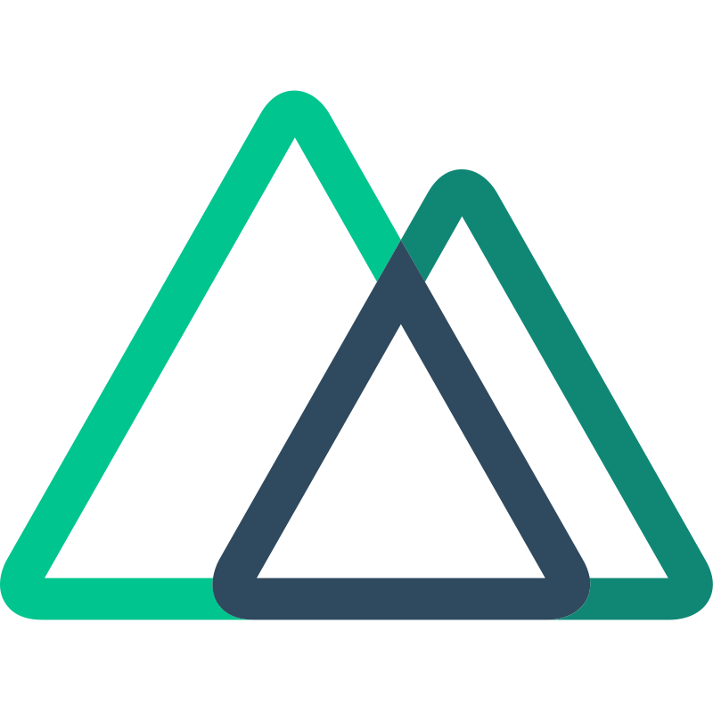

# Code with Dmitrii
**`Javascript developer`**

Dive into the world of web development. As a passionate JavaScript developer, I'm here to share my knowledge, experience, and coding adventures. Whether you're a beginner or an experienced coder, this site is your go-to resource for tutorials, tips, and insights on everything from Vue and React to cutting-edge web technologies. Let's code together and create something amazing! 

   

       
       
      
      
   

---

### 🧰 Languages and Tools

 

#

### 📊 Stats

